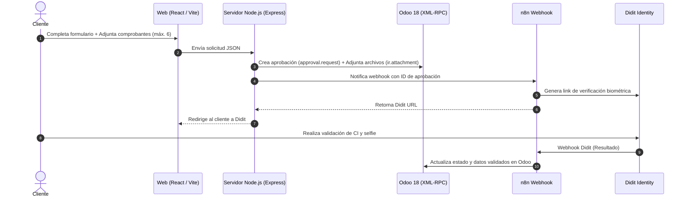

# Portal de Solicitudes de Leasing — Teklease

Sistema web institucional para la recepción, procesamiento y aprobación de solicitudes de leasing de **Teklease (Richford Paraguay S.A.)**, integrado directamente con **Odoo 18** via XML-RPC y con el flujo de verificación de identidad de **Didit** a través de **n8n**.
 **URL de Producción:** [https://formulario.teklease.com.py](https://formulario.teklease.com.py)

---

##  Arquitectura y Flujo de Trabajo



---

##  Características Principales

- **Formulario Optimizado:** Diseño responsivo y centrado con paleta corporativa slate-grey.
- **Subida de Múltiples Archivos:** Permite adjuntar hasta 6 comprobantes de ingresos simultáneos (PDF/Imagen) con opción de previsualización y eliminación antes de enviar.
- **Validaciones Inteligentes:**
  - Validación de teléfono (formato Paraguay `09XXXXXXXX`).
  - Validación de campos geográficos (Departamento, Distrito, Ciudad, Barrio) con carga dinámica desde Odoo.
  - Formato libre para Cuenta Catastral (condicional para clientes tipo recolectora).
- **Integración XML-RPC Odoo 18:**
  - Carga dinámica de opciones (Packs de Leasing, Modelos, Colores, Sucursales, Agentes).
  - Creación automática de `approval.request` y adjuntos en el Chatter (`ir.attachment`).
- **Seguridad SSL & Reverse Proxy:**
  - Gestionado por **Traefik** con certificados automáticos de **Let's Encrypt** sobre `formulario.teklease.com.py`.

---

## 🛠️ Tecnologías Utilizadas

- **Frontend:** React 19, Vite 6, TailwindCSS 4, Lucide Icons, Motion (Framer Motion).
- **Backend:** Node.js, Express, XML-RPC Client.
- **Servidor & Infraestructura:** VPS Ubuntu, PM2, Traefik Reverse Proxy, Docker.
- **Integraciones:** Odoo 18 Enterprise / Community, n8n Automation Engine, Didit API.

---

##  Desarrollo Local

### Requisitos Previos

- Node.js (v18+)
- npm

### Pasos para Ejecutar

1. Clonar el repositorio:
   ```bash
   git clone https://github.com/App-Leasing/aprobaciones-formulario.git
   cd aprobaciones-formulario
   ```

2. Instalar dependencias:
   ```bash
   npm install
   ```

3. Configurar variables de entorno (`.env`):
   ```env
   ODOO_URL="https://mergal.odoo.com"
   ODOO_DB="mergal-master-24463314"
   ODOO_USERNAME="sistemas@paracan.com.py"
   ODOO_PASSWORD="tu_password_o_api_key"
   PORT=3000
   ```

4. Iniciar servidor de desarrollo:
   ```bash
   npm run dev
   ```
   Acceder a `http://localhost:3000`.

---

##  Flujo de Despliegue en VPS (Producción)

El despliegue está automatizado mediante Git y un script helper en el servidor.

### 1. Subir cambios desde la máquina local
```bash
git add .
git commit -m "feat: descripción de tus cambios"
git push origin main
```

### 2. Desplegar en el VPS
Conectarse via SSH al VPS y ejecutar el script automatizado:
```bash
cd /var/www/aprobaciones && ./update.sh
```

El script `./update.sh` ejecuta automáticamente:
1. `git pull origin main`
2. `npm install`
3. `npm run build`
4. `pm2 restart odoo-backend`

---

##  Licencia y Propiedad

Desarrollado para **Teklease / Richford Paraguay S.A.** — Portal Institucional de Aprobaciones.
